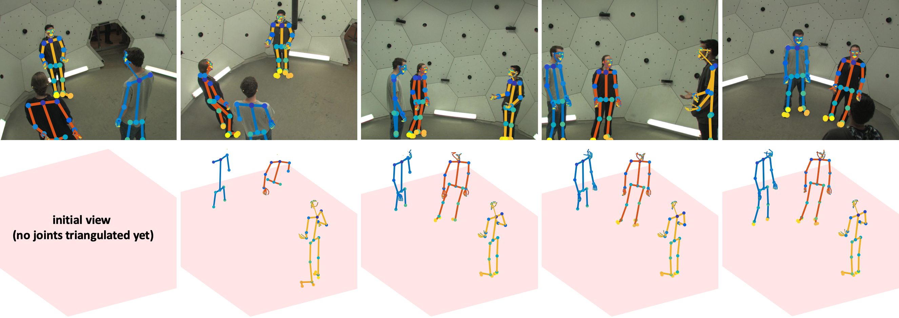
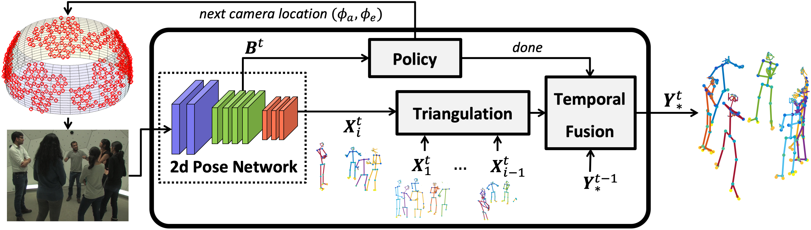

# Domes to Drones: Self-Supervised Active Triangulation for 3D Human Pose Reconstruction

**Authors:** [Erik Gärtner](https://gartner.io/)\*, [Aleksis Pirinen](https://aleksispi.github.io/)\* and [Cristian Sminchisescu](http://www.maths.lth.se/sminchisescu/) _(* denotes first authorship)_.

## Overview
Official implementation of the NeurIPS 2019 paper _Domes to Drones: Self-Supervised Active Triangulation for 3D Human Pose Reconstruction_.
This repo contains code for reproducing the results of our proposed ACTOR model and the baselines, as well as training ACTOR on Panoptic.

ACTOR is implemented in [Caffe](https://github.com/BVLC/caffe). The experiments are performed in the [CMU Panoptic](http://domedb.perception.cs.cmu.edu/) multi-camera framework.
Our ACTOR implementation uses [OpenPose](https://github.com/CMU-Perceptual-Computing-Lab/openpose) as underlying 2d pose estimator. We have used
a public [TensorFlow implementation](https://gist.github.com/alesolano/b073d8ec9603246f766f9f15d002f4f4) for pre-computing all pose and deep feature predictions from OpenPose.

### Citation
If you find this implementation and/or our paper interesting or helpful, please consider citing:

    @article{pirinen2019self,
        Author = {Aleksis Pirinen, Erik Gärtner and Cristian Sminchisescu},
        Title = {Domes to Drones: Self-Supervised Active Triangulation for 3D Human Pose Reconstruction},
        Journal = {NeurIPS},
        Year = {2019}
    }

## Setup
1. Clone the repository
2. Read the following [documentation](INSTALL.md) on how to setup our system. This covers prerequisites and how to install our framework.
3. See this [dataset documentation](dataset/README.md) for how to download and preprocess the Panoptic data, pre-compute OpenPose deep features and pose estimates and train/download instance features for matching.

## Pretrained models
Pretrained model weights for ACTOR can be downloaded [here](https://lu.box.com/s/tb2ldr28kztu0i2gclpi2etrwflvvw2j).

## Using ACTOR

### Demo

### Train Model

### Evaluate Model

## License

### Acknowledgements
This work was supported by the European Research Council Consolidator grant SEED, CNCS-UEFISCDI PN-III-P4-ID-PCE-2016-0535 and PCCF-2016-0180, the EU Horizon 2020 Grant DE-ENIGMA, Swedish Foundation for Strategic Research (SSF) Smart Systems Program, as well as the Wallenberg AI, Autonomous Systems and Software Program ([WASP](https://wasp-sweden.org/)) funded by the Knut and Alice Wallenberg Foundation. We would also like to thank [Patrik Persson](https://www.lu.se/lucat/user/10eb4de90f6e28dc2efccfd0269d5c92) for support with the drone experiments.
